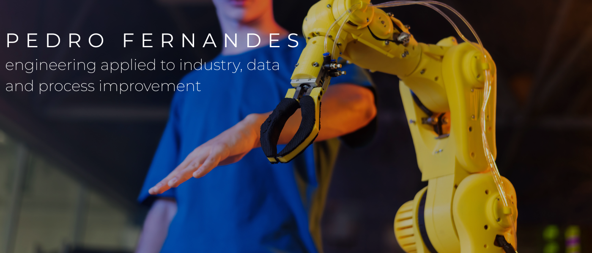

  

 

I am a **Mechanical Engineering student at CEFET/RJ** and a **Mechanical Technician with active CFT registration**, currently working as a **Mechanical Engineering Intern at NUCLEP** in a heavy industrial manufacturing environment.

My work connects **mechanical engineering, industrial processes, data analysis and Python automation** to build practical solutions for manufacturing, maintenance, quality and process improvement.

I am especially interested in **industrial maintenance, quality, manufacturing processes, industrial automation, oil & gas/offshore, heavy industry and applied engineering**.

---

## Featured work

* [Industrial Operations Hub](https://github.com/Pedro-fcosta/industrial-operations-hub) — Python and Flask system for industrial operations control, integrating traceability, machine maintenance, material waiting status and visual machine status mapping.

* [KeyProtect — Key Control System](https://github.com/Pedro-fcosta/keyprotect-cefet) — Web system for institutional key withdrawal, return and traceability, with PIN authentication, movement history, dashboard and data export features.

* [Computational Modeling and Simulation of Dynamical Systems](https://github.com/Pedro-fcosta/Computational-Modeling-and-Simulation-of-Dynamical-Systems) — Computational modeling and numerical simulation of dynamical systems using Python.

* **Lessons Learned System** — System for registering, organizing and generating standardized lessons learned reports for industrial routines.
  *Coming soon.*

---

## Main tools and interests

**Tools:** Python, Flask, SQLite, Excel, Power BI, Siemens NX, HTML, CSS
**Areas:** Mechanical Engineering, Industrial Automation, Manufacturing Processes, Quality, Maintenance, Data Analysis, Oil & Gas / Offshore

---

## Find me around the web

* [LinkedIn](https://www.linkedin.com/in/pedro-fernandes-costa/)
* [GitHub Portfolio](https://github.com/Pedro-fcosta)
* [Email](mailto:pedrofernandesdacosta96@gmail.com)
